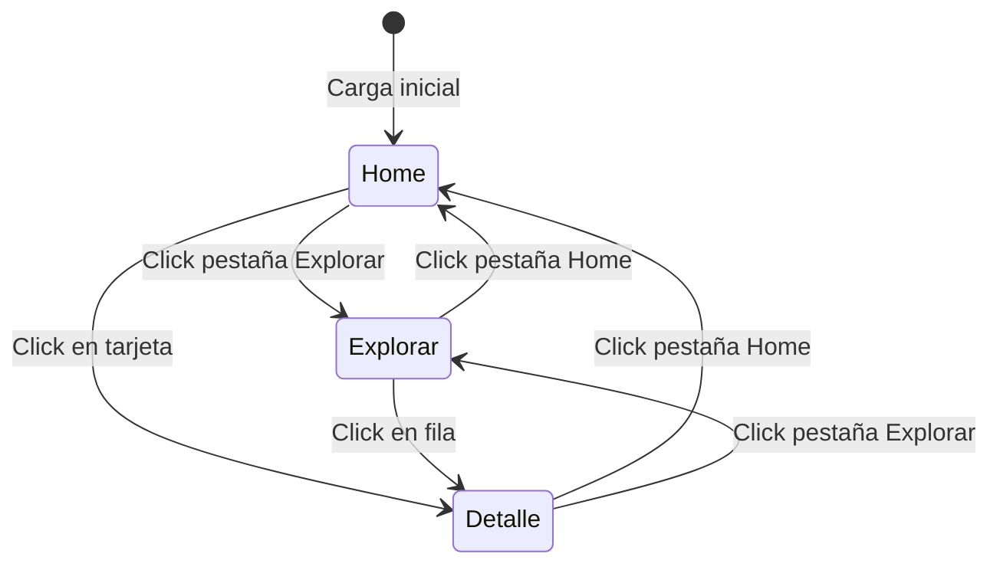
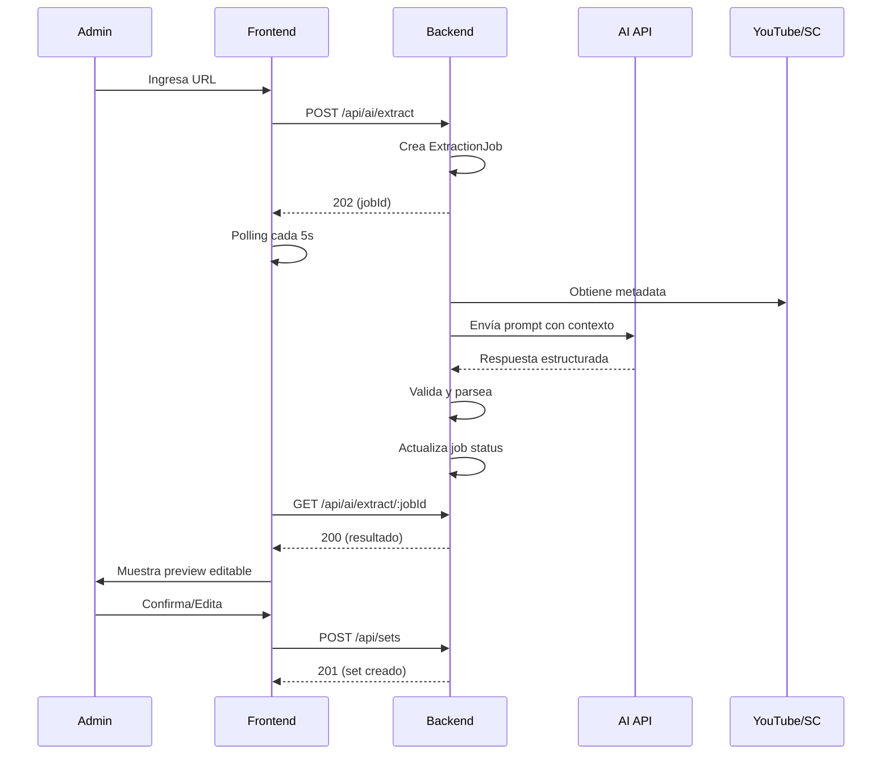

# Design Document - Set Finder

## Overview

Set Finder es una Progressive Web App (PWA) construida con React que proporciona una experiencia inmersiva para explorar tracklists de sets de DJ. La aplicación combina las ventajas de una SPA (Single Page Application) con capacidades de app nativa: funciona offline, es instalable en cualquier dispositivo, y se adapta perfectamente a móviles, tablets y escritorio. Utiliza un diseño de pantalla completa con temática de neón oscuro y navegación fluida entre múltiples vistas: Home, Explorar, Favoritos, Detalle y Admin.

### Tecnologías Principales

**Frontend**:
- **Framework**: React 18+ con Hooks
- **Build Tool**: Vite (para mejor performance y PWA support)
- **PWA**: Workbox para service workers y caching strategies
- **Manifest**: Web App Manifest para instalación
- **Estilos**: Tailwind CSS + CSS personalizado para efectos de neón
- **Gestión de Estado**: React Context API + useState/useMemo
- **Iconos**: SVG inline personalizados
- **Fuentes**: Google Fonts (Inter) con preload
- **HTTP Client**: Axios con interceptors
- **Offline Support**: IndexedDB para cache local

**Backend**:
- **Backend-as-a-Service**: Firebase (Google Cloud Platform)
- **Base de Datos**: Cloud Firestore (NoSQL, tiempo real)
- **Autenticación**: Firebase Authentication (Email/Password, Google, etc.)
- **Storage**: Firebase Storage para assets (iconos, screenshots)
- **Hosting**: Firebase Hosting (PWA con CDN global automático)
- **Functions**: Cloud Functions for Firebase (Node.js 18+)
- **IA/ML**: OpenAI API (GPT-4) o Google Vertex AI para extracción de tracklists
- **Validación**: Zod para validación de schemas
- **Security**: Firebase Security Rules para Firestore y Storage

**Infraestructura** (Firebase/GCP unificado):
- **Hosting Frontend**: Firebase Hosting (CDN global automático, SSL gratis)
- **Backend Logic**: Cloud Functions for Firebase (serverless)
- **Base de Datos**: Cloud Firestore (NoSQL con sync en tiempo real)
- **Autenticación**: Firebase Authentication (múltiples providers)
- **Storage**: Firebase Storage (para iconos, screenshots, assets)
- **IA**: OpenAI API o Google Vertex AI (Gemini Pro)
- **Secrets**: Firebase Config + Google Secret Manager
- **Analytics**: Google Analytics 4 (integrado)
- **Monitoring**: Firebase Crashlytics + Performance Monitoring
- **CI/CD**: Firebase CLI + GitHub Actions

**Ventajas de Firebase**:
- ✅ Todo en una sola plataforma (Google)
- ✅ Free Tier muy generoso (suficiente para MVP)
- ✅ Firestore con sync en tiempo real (perfecto para favoritos)
- ✅ Authentication listo para usar (sin implementar JWT)
- ✅ Hosting con CDN global automático
- ✅ Security Rules declarativas (sin backend custom)
- ✅ SDK de JavaScript muy maduro
- ✅ Escalabilidad automática
- ✅ Documentación excelente

**Estimación de costos mensuales** (Spark Plan - Free Tier):
- **Firestore**: 1GB storage, 50k reads, 20k writes, 20k deletes/día GRATIS
- **Authentication**: Usuarios ilimitados GRATIS
- **Hosting**: 10GB storage, 360MB/día transfer GRATIS
- **Cloud Functions**: 2M invocations/mes, 400k GB-sec GRATIS
- **Storage**: 5GB storage, 1GB/día download GRATIS
- **OpenAI API**: $10-30/mes (uso moderado de IA para extracciones)

**Total estimado**: $10-30/mes (solo IA, resto gratis hasta escalar)

**Cuándo migrar a Blaze Plan** (Pay-as-you-go):
- Más de 50k lecturas/día en Firestore
- Más de 360MB/día de tráfico en Hosting
- Más de 2M invocaciones/mes en Functions
- Estimado: $20-50/mes adicionales con tráfico moderado

## Architecture

### Arquitectura de Componentes

```
App (Componente Principal)
├── AuthProvider (Context de autenticación)
├── GlobalStyles (Estilos CSS globales)
├── GlobalHeader (Navegación fija)
│   ├── Tab: Home
│   ├── Tab: Explorar
│   ├── Tab: Mis Favoritos (si autenticado)
│   ├── LoginButton / UserMenu
│   └── AdminButton (si es admin)
├── AuthModal (Login/Register)
├── SetBrowser (Vista Home/Explorar)
│   ├── SetCard[] (Grid de tarjetas - Home)
│   │   └── FavoriteButton (si autenticado)
│   └── SetTable (Tabla con búsqueda - Explorar)
├── FavoritesView (Vista de favoritos del usuario)
├── TracklistDetail (Vista Detalle)
│   ├── Header (Información del set - sticky)
│   │   └── FavoriteButton (si autenticado)
│   └── TracklistTable (Tabla scrollable)
└── AdminPanel (Solo para admins)
    ├── SetList (CRUD de sets)
    ├── AIExtractor (Extracción con IA)
    └── UserManagement (Gestión de usuarios)
```

### Arquitectura Backend (Firebase)

```
Firebase Project
├── Firestore Database
│   ├── users (colección)
│   │   └── {userId}
│   │       ├── email, name, role, createdAt
│   │       └── favorites (array de set IDs)
│   ├── sets (colección)
│   │   └── {setId}
│   │       ├── artist, event, stage, date, location
│   │       ├── source, youtubeUrl, description
│   │       ├── bpmRange, mainGenre, duration
│   │       ├── theme, tracklist (array)
│   │       ├── createdBy, createdAt, updatedAt
│   │       └── favoriteCount
│   └── extractionJobs (colección)
│       └── {jobId}
│           ├── userId, sourceUrl, platform
│           ├── status, result, error
│           └── createdAt, completedAt
│
├── Cloud Functions
│   ├── createSet (HTTPS callable - admin only)
│   ├── updateSet (HTTPS callable - admin only)
│   ├── deleteSet (HTTPS callable - admin only)
│   ├── toggleFavorite (HTTPS callable - auth required)
│   ├── extractTracklist (HTTPS callable - admin only)
│   ├── onSetDeleted (Firestore trigger - cleanup)
│   └── onFavoriteToggled (Firestore trigger - update count)
│
├── Firebase Authentication
│   ├── Email/Password provider
│   ├── Google provider (opcional)
│   └── Custom claims (role: admin)
│
├── Firebase Storage
│   └── /public
│       ├── /icons (app icons)
│       └── /screenshots (app screenshots)
│
└── Firebase Security Rules
    ├── firestore.rules (acceso a colecciones)
    └── storage.rules (acceso a archivos)
```

**Ventajas de esta arquitectura**:
- Sin servidor Express (serverless 100%)
- Sin gestión de JWT (Firebase Auth lo maneja)
- Sin base de datos a mantener (Firestore managed)
- Triggers automáticos (onSetDeleted, onFavoriteToggled)
- Security Rules declarativas (sin middleware custom)
- Sync en tiempo real (favoritos se actualizan automáticamente)

### Flujo de Navegación



### Gestión de Estado

El estado de la aplicación se maneja mediante React Context API y hooks:

**AuthContext** (Global):
- `user`: User | null - Usuario autenticado actual
- `token`: String | null - JWT token
- `isAdmin`: Boolean - Si el usuario es administrador
- `login(email, password)`: Function - Iniciar sesión
- `register(email, password, name)`: Function - Registrar usuario
- `logout()`: Function - Cerrar sesión
- `refreshToken()`: Function - Renovar token

**AppState** (Local):
- `mainView`: String ('home' | 'explore' | 'favorites' | 'admin') - Vista activa
- `activeSetKey`: String | null - ID del set seleccionado
- `searchTerm`: String - Término de búsqueda
- `sets`: SetData[] - Lista de sets (cargada desde API)
- `favorites`: String[] - IDs de sets favoritos del usuario
- `isLoading`: Boolean - Estado de carga
- `error`: String | null - Mensaje de error

## Database Schema (Firestore)

### Firestore Collections

#### users Collection

```javascript
// Document ID: Firebase Auth UID
{
  email: string,
  name: string,
  role: string, // 'user' | 'admin'
  favorites: string[], // Array de set IDs
  createdAt: Timestamp,
  updatedAt: Timestamp
}
```

**Índices compuestos** (creados automáticamente):
- `role` (para queries de admin)

**Security Rules**:
```javascript
match /users/{userId} {
  // Los usuarios solo pueden leer/escribir su propio documento
  allow read: if request.auth != null && request.auth.uid == userId;
  allow write: if request.auth != null && request.auth.uid == userId;
  
  // Admins pueden leer todos los usuarios
  allow read: if request.auth.token.admin == true;
  
  // Solo admins pueden cambiar roles
  allow update: if request.auth.token.admin == true 
                && request.resource.data.diff(resource.data).affectedKeys().hasOnly(['role']);
}
```

#### sets Collection

```javascript
// Document ID: Auto-generado por Firestore
{
  artist: string,
  event: string,
  stage: string,
  date: string,
  location: string,
  source: {
    name: string,
    url: string
  },
  youtubeUrl: string | null,
  description: string,
  bpmRange: string,
  mainGenre: string,
  duration: string,
  unidentifiedTracks: number,
  totalTracks: number,
  theme: {
    primary: string,
    secondary: string,
    border: string,
    headerBG: string,
    camelot: string,
    divider: string
  },
  tracklist: [{
    title: string,
    artist: string,
    startTime?: string,
    bpm?: number,
    energy?: string,
    genre?: string,
    tone?: string,
    notes?: string
  }],
  createdBy: string, // User ID
  createdAt: Timestamp,
  updatedAt: Timestamp,
  favoriteCount: number // Denormalizado para performance
}
```

**Índices compuestos**:
- `mainGenre` + `createdAt` (para filtrar por género y ordenar)
- `favoriteCount` + `createdAt` (para ordenar por popularidad)
- `createdAt` (descendente, para últimos añadidos)

**Security Rules**:
```javascript
match /sets/{setId} {
  // Todos pueden leer sets
  allow read: if true;
  
  // Solo admins pueden crear/actualizar/eliminar
  allow create, update, delete: if request.auth.token.admin == true;
}
```

#### extractionJobs Collection

```javascript
// Document ID: Auto-generado por Firestore
{
  userId: string,
  sourceUrl: string,
  platform: string, // 'youtube' | 'soundcloud'
  status: string, // 'pending' | 'processing' | 'completed' | 'failed'
  result?: {
    artist: string,
    event: string,
    tracklist: array,
    suggestedTheme: object,
    confidence: string,
    notes?: string
  },
  error?: string,
  createdAt: Timestamp,
  completedAt?: Timestamp
}
```

**Índices compuestos**:
- `userId` + `createdAt` (para ver jobs de un usuario)
- `status` + `createdAt` (para monitorear jobs pendientes)

**Security Rules**:
```javascript
match /extractionJobs/{jobId} {
  // Solo el usuario que creó el job o admins pueden leerlo
  allow read: if request.auth != null && 
                 (resource.data.userId == request.auth.uid || 
                  request.auth.token.admin == true);
  
  // Solo admins pueden crear jobs
  allow create: if request.auth.token.admin == true;
  
  // Nadie puede actualizar/eliminar manualmente (solo Cloud Functions)
  allow update, delete: if false;
}
```

### Firestore vs MongoDB: Diferencias Clave

**Ventajas de Firestore**:
- ✅ Sync en tiempo real (favoritos se actualizan automáticamente)
- ✅ Offline persistence nativa (PWA perfecto)
- ✅ Security Rules declarativas (sin backend)
- ✅ Escalabilidad automática
- ✅ Queries más simples (sin agregaciones complejas)
- ✅ SDK optimizado para web

**Limitaciones de Firestore**:
- ❌ No hay búsqueda full-text nativa (usar Algolia o client-side)
- ❌ Queries limitadas (no hay OR, no hay != en arrays)
- ❌ Costo por operación (reads/writes) vs costo fijo MongoDB

**Solución para búsqueda**:
- Opción 1: Búsqueda client-side (cargar todos los sets, filtrar en memoria)
- Opción 2: Algolia (servicio de búsqueda, Free Tier: 10k requests/mes)
- Opción 3: Cloud Functions con búsqueda manual en arrays

## Components and Interfaces

### 1. GlobalStyles Component

**Propósito**: Inyectar estilos CSS globales y clases de utilidad para temas de neón.

**Implementación**:
- Componente funcional que retorna un elemento `<style>` con CSS inline
- Define clases de neón para cada color: `.neon-accent-{color}`, `.border-neon-{color}`, `.camelot-key-{color}`
- Incluye media queries para responsividad
- Define estilos base para body, tablas y efectos hover

**Colores de Neón Soportados**:
- Violet (#d15fff)
- Blue (#4df9ff)
- Red (#ff4747)
- Cyan (#00f2ea)
- Green (#39ff14)
- Orange (#ff8c00)
- Pink (#ff1493)
- Ultra Orange (#ff7f00)
- Diynamic Blue (#007bff)
- White (#ffffff)

### 2. GlobalHeader Component

**Props**:
```typescript
interface GlobalHeaderProps {
  mainView: 'home' | 'explore';
  onSetView: (view: 'home' | 'explore') => void;
}
```

**Comportamiento**:
- Renderiza navegación fija con altura de 60px
- Aplica clase `global-tab-active` a la pestaña activa
- Aplica clase `global-tab-inactive` a pestañas inactivas
- Llama a `onSetView` al hacer click en pestañas

**Estilos**:
- Fondo: #130f25
- Borde inferior: 2px solid purple-700/50
- Posición: sticky top-0 z-30

### 3. SetBrowser Component

**Props**:
```typescript
interface SetBrowserProps {
  onSelectSet: (setKey: string) => void;
  viewMode: 'home' | 'explore';
}
```

**Estado Interno**:
- `searchTerm`: String para filtrado en modo 'explore'

**Lógica de Filtrado**:
```javascript
// Filtrado case-insensitive en campos: artist, event, stage, date, location
const filtered = sets.filter(set => 
  set.artist.toLowerCase().includes(searchTerm.toLowerCase()) ||
  set.event.toLowerCase().includes(searchTerm.toLowerCase()) ||
  // ... otros campos
);
```

**Renderizado Condicional**:
- **Home**: Grid de 4 columnas (lg:grid-cols-4) con primeros 4 sets
- **Explore**: Tabla completa con barra de búsqueda

### 4. SetCard Component

**Props**:
```typescript
interface SetCardProps {
  setKey: string;
  set: SetData;
  onSelectSet: (setKey: string) => void;
}
```

**Estructura Visual**:
```
┌─────────────────────────────┐
│ Artist (neon color)         │
│ Event                       │
│ Stage (secondary color)     │
│ Date | Location             │
│                             │
│ "Description..." (3 lines)  │
│                             │
├─────────────────────────────┤
│ Tracks: XX | Duración: XXm  │
└─────────────────────────────┘
```

**Efectos Hover**:
- Borde: Cambia a color neón del set
- Transform: translateY(-4px)
- Shadow: Sombra cyan con blur

### 5. SetTable Component

**Props**:
```typescript
interface SetTableProps {
  sets: [string, SetData][];
  onSelectSet: (setKey: string) => void;
}
```

**Columnas**:
1. Artista (con color neón)
2. Evento
3. Fecha (oculta en móvil)
4. Lugar (oculta en móvil)

**Características**:
- Header sticky con fondo #2b1f47
- Filas clickables con hover effect
- Scroll vertical con max-height: calc(100vh - 250px)
- Mensaje "No se encontraron sets" cuando filtro no tiene resultados

### 6. TracklistDetail Component

**Props**:
```typescript
interface TracklistDetailProps {
  set: SetData;
}
```

**Estructura**:

#### Header Section (Sticky)
- Altura variable según contenido
- Fondo: #1a1a2e
- Posición: sticky top-0 z-10
- Contenido:
  - Título del artista (h1 con color theme.primary)
  - Evento y stage (h2)
  - Descripción (párrafo italic)
  - Panel de estadísticas (flex wrap)
  - Icono YouTube (enlace directo o búsqueda)
  - Fuente del tracklist (enlace)

#### Tracklist Table (Scrollable)
- Max-height: calc(100vh - 350px)
- Overflow-y: auto
- Header sticky con background theme.headerBG
- Columnas:
  1. Inicio (startTime) - 16px width
  2. Canción (title + artist) - 1/4 width
  3. BPM - auto width (oculto móvil)
  4. Género - 1/6 width
  5. Tono - 1/12 width (con color theme.camelot)
  6. Energía - 1/6 width (coloreado según valor)
  7. Notas - 1/4 width (oculto móvil)
  8. Escuchar - 1/12 width (iconos Spotify/SoundCloud)

### 7. Icon Components

Componentes SVG inline para:
- HomeIcon
- LayoutGrid (Explorar)
- Search
- SpotifyIcon
- SoundCloudIcon
- YoutubeIcon
- ChevronDown
- XIcon
- HeartIcon (favoritos)
- UserIcon
- LogoutIcon
- SettingsIcon (admin)

**Ventajas de SVG inline**:
- No requiere dependencias externas
- Fácil personalización de color y tamaño
- Mejor rendimiento (no hay requests HTTP)

### 8. AuthModal Component

**Props**:
```typescript
interface AuthModalProps {
  isOpen: boolean;
  onClose: () => void;
  initialMode?: 'login' | 'register';
}
```

**Estado Interno**:
- `mode`: 'login' | 'register'
- `email`: String
- `password`: String
- `name`: String (solo para register)
- `error`: String | null
- `isLoading`: Boolean

**Comportamiento**:
- Modal centrado con backdrop oscuro
- Toggle entre login y register
- Validación de formulario
- Manejo de errores de API
- Cierra automáticamente al login exitoso

**Validaciones**:
- Email: formato válido
- Password: mínimo 8 caracteres
- Name: mínimo 2 caracteres (register)

### 9. FavoriteButton Component

**Props**:
```typescript
interface FavoriteButtonProps {
  setId: string;
  isFavorite: boolean;
  onToggle: (setId: string) => Promise<void>;
}
```

**Comportamiento**:
- Icono de corazón (outline si no es favorito, filled si lo es)
- Click llama a API para toggle favorito
- Animación de "latido" al marcar como favorito
- Disabled durante request
- Tooltip: "Añadir a favoritos" / "Quitar de favoritos"

**Estados**:
- Normal: Gris
- Hover: Color neón
- Favorito: Rojo/Rosa con glow
- Loading: Spinner

### 10. AdminPanel Component

**Props**:
```typescript
interface AdminPanelProps {
  // No props, usa AuthContext internamente
}
```

**Secciones**:

#### 10.1 SetList (CRUD)
- Tabla con todos los sets
- Botones: Crear, Editar, Eliminar
- Formulario modal para crear/editar
- Confirmación para eliminar
- Paginación (20 sets por página)

#### 10.2 AIExtractor
- Input para URL (YouTube o SoundCloud)
- Botón "Extraer Tracklist"
- Loading state con progreso
- Preview de resultado antes de guardar
- Edición manual de campos extraídos
- Botón "Guardar Set"

#### 10.3 UserManagement
- Tabla de usuarios
- Columnas: Email, Nombre, Rol, Fecha registro, # Favoritos
- Cambiar rol (user ↔ admin)
- Eliminar usuario (con confirmación)
- Búsqueda por email/nombre

### 11. FavoritesView Component

**Props**:
```typescript
interface FavoritesViewProps {
  // No props, usa AuthContext y carga favoritos
}
```

**Comportamiento**:
- Similar a SetBrowser pero solo muestra favoritos del usuario
- Grid de tarjetas (igual que Home)
- Mensaje si no hay favoritos: "Aún no tienes sets favoritos. ¡Explora y marca tus favoritos!"
- Botón para ir a Explorar
- Ordenar por: Fecha añadido, Artista, Evento

### 12. AuthProvider Component

**Context Value**:
```typescript
interface AuthContextValue {
  user: User | null;
  token: string | null;
  isAdmin: boolean;
  isLoading: boolean;
  login: (email: string, password: string) => Promise<void>;
  register: (email: string, password: string, name: string) => Promise<void>;
  logout: () => void;
  refreshToken: () => Promise<void>;
}
```

**Comportamiento**:
- Carga token desde localStorage al montar
- Verifica token al cargar app
- Refresca token automáticamente antes de expirar
- Limpia estado al logout
- Intercepta errores 401 y hace logout automático

## Cloud Functions (Callable Functions)

### Authentication

**Manejado por Firebase Authentication SDK** (no requiere Cloud Functions):

```typescript
// Frontend - Registro
const { user } = await createUserWithEmailAndPassword(auth, email, password);
await setDoc(doc(db, 'users', user.uid), {
  email,
  name,
  role: 'user',
  favorites: [],
  createdAt: serverTimestamp()
});

// Frontend - Login
const { user } = await signInWithEmailAndPassword(auth, email, password);

// Frontend - Logout
await signOut(auth);

// Frontend - Obtener token
const token = await user.getIdToken();
```

**Custom Claims para Admin** (Cloud Function):

```typescript
// functions/src/setAdminRole.ts
export const setAdminRole = functions.https.onCall(async (data, context) => {
  // Solo super-admin puede ejecutar esto (configurado manualmente)
  if (!context.auth?.token.superAdmin) {
    throw new functions.https.HttpsError('permission-denied', 'No autorizado');
  }
  
  await admin.auth().setCustomUserClaims(data.userId, { admin: true });
  
  return { message: 'Usuario promovido a admin' };
});
```

### Sets Management

**Lectura de sets** (directo desde Firestore, no requiere Cloud Function):

```typescript
// Frontend - Obtener todos los sets (últimos 20)
const setsQuery = query(
  collection(db, 'sets'),
  orderBy('createdAt', 'desc'),
  limit(20)
);
const snapshot = await getDocs(setsQuery);
const sets = snapshot.docs.map(doc => ({ id: doc.id, ...doc.data() }));

// Frontend - Obtener un set específico
const setDoc = await getDoc(doc(db, 'sets', setId));
const set = { id: setDoc.id, ...setDoc.data() };

// Frontend - Búsqueda por género
const genreQuery = query(
  collection(db, 'sets'),
  where('mainGenre', '==', 'Techno'),
  orderBy('createdAt', 'desc')
);
```

**Cloud Functions para CRUD** (solo admin):

```typescript
// functions/src/createSet.ts
export const createSet = functions.https.onCall(async (data, context) => {
  // Verificar que el usuario es admin
  if (!context.auth?.token.admin) {
    throw new functions.https.HttpsError('permission-denied', 'Solo admins');
  }
  
  // Validar datos
  const setData = SetSchema.parse(data);
  
  // Crear set
  const setRef = await addDoc(collection(db, 'sets'), {
    ...setData,
    createdBy: context.auth.uid,
    createdAt: serverTimestamp(),
    updatedAt: serverTimestamp(),
    favoriteCount: 0
  });
  
  return { id: setRef.id, message: 'Set creado exitosamente' };
});

// functions/src/updateSet.ts
export const updateSet = functions.https.onCall(async (data, context) => {
  if (!context.auth?.token.admin) {
    throw new functions.https.HttpsError('permission-denied', 'Solo admins');
  }
  
  const { setId, ...updates } = data;
  
  await updateDoc(doc(db, 'sets', setId), {
    ...updates,
    updatedAt: serverTimestamp()
  });
  
  return { message: 'Set actualizado exitosamente' };
});

// functions/src/deleteSet.ts
export const deleteSet = functions.https.onCall(async (data, context) => {
  if (!context.auth?.token.admin) {
    throw new functions.https.HttpsError('permission-denied', 'Solo admins');
  }
  
  await deleteDoc(doc(db, 'sets', data.setId));
  
  return { message: 'Set eliminado exitosamente' };
});
```

**Firestore Trigger** (limpieza automática):

```typescript
// functions/src/onSetDeleted.ts
export const onSetDeleted = functions.firestore
  .document('sets/{setId}')
  .onDelete(async (snap, context) => {
    const setId = context.params.setId;
    
    // Eliminar el set de los favoritos de todos los usuarios
    const usersQuery = query(
      collection(db, 'users'),
      where('favorites', 'array-contains', setId)
    );
    
    const usersSnapshot = await getDocs(usersQuery);
    const batch = writeBatch(db);
    
    usersSnapshot.docs.forEach(userDoc => {
      batch.update(userDoc.ref, {
        favorites: arrayRemove(setId)
      });
    });
    
    await batch.commit();
    
    console.log(`Set ${setId} eliminado de favoritos de ${usersSnapshot.size} usuarios`);
  });
```

### Favorites Management

**Cloud Function**:

```typescript
// functions/src/toggleFavorite.ts
export const toggleFavorite = functions.https.onCall(async (data, context) => {
  if (!context.auth) {
    throw new functions.https.HttpsError('unauthenticated', 'Debes iniciar sesión');
  }
  
  const { setId } = data;
  const userId = context.auth.uid;
  
  const userRef = doc(db, 'users', userId);
  const userDoc = await getDoc(userRef);
  
  if (!userDoc.exists()) {
    throw new functions.https.HttpsError('not-found', 'Usuario no encontrado');
  }
  
  const favorites = userDoc.data().favorites || [];
  const isFavorite = favorites.includes(setId);
  
  if (isFavorite) {
    // Eliminar de favoritos
    await updateDoc(userRef, {
      favorites: arrayRemove(setId)
    });
    
    // Decrementar contador en el set
    await updateDoc(doc(db, 'sets', setId), {
      favoriteCount: increment(-1)
    });
    
    return { isFavorite: false, message: 'Eliminado de favoritos' };
  } else {
    // Añadir a favoritos
    await updateDoc(userRef, {
      favorites: arrayUnion(setId)
    });
    
    // Incrementar contador en el set
    await updateDoc(doc(db, 'sets', setId), {
      favoriteCount: increment(1)
    });
    
    return { isFavorite: true, message: 'Añadido a favoritos' };
  }
});
```

**Frontend - Obtener favoritos**:

```typescript
// Directo desde Firestore (tiempo real)
const userDoc = await getDoc(doc(db, 'users', userId));
const favoriteIds = userDoc.data().favorites || [];

// Obtener sets completos
const favoriteSets = await Promise.all(
  favoriteIds.map(id => getDoc(doc(db, 'sets', id)))
);

// Con listener en tiempo real
onSnapshot(doc(db, 'users', userId), (doc) => {
  const favoriteIds = doc.data().favorites || [];
  // Actualizar UI automáticamente
});
```

### AI Extraction

**Cloud Function**:

```typescript
// functions/src/extractTracklist.ts
export const extractTracklist = functions
  .runWith({ timeoutSeconds: 300, memory: '1GB' }) // 5 minutos timeout
  .https.onCall(async (data, context) => {
    if (!context.auth?.token.admin) {
      throw new functions.https.HttpsError('permission-denied', 'Solo admins');
    }
    
    const { url, platform } = data;
    
    // Crear job
    const jobRef = await addDoc(collection(db, 'extractionJobs'), {
      userId: context.auth.uid,
      sourceUrl: url,
      platform,
      status: 'processing',
      createdAt: serverTimestamp()
    });
    
    try {
      // Obtener metadata del video (usando API de YouTube o scraping)
      const metadata = await getVideoMetadata(url, platform);
      
      // Llamar a OpenAI/Vertex AI
      const aiResponse = await callAIService({
        videoTitle: metadata.title,
        videoDescription: metadata.description,
        duration: metadata.duration,
        platform
      });
      
      // Validar respuesta
      const result = AIExtractionSchema.parse(aiResponse);
      
      // Actualizar job
      await updateDoc(doc(db, 'extractionJobs', jobRef.id), {
        status: 'completed',
        result,
        completedAt: serverTimestamp()
      });
      
      return { jobId: jobRef.id, status: 'completed', result };
      
    } catch (error) {
      // Actualizar job con error
      await updateDoc(doc(db, 'extractionJobs', jobRef.id), {
        status: 'failed',
        error: error.message,
        completedAt: serverTimestamp()
      });
      
      throw new functions.https.HttpsError('internal', error.message);
    }
  });
```

**Frontend - Polling del job**:

```typescript
// Escuchar cambios en tiempo real
const unsubscribe = onSnapshot(
  doc(db, 'extractionJobs', jobId),
  (doc) => {
    const job = doc.data();
    if (job.status === 'completed') {
      setResult(job.result);
      unsubscribe();
    } else if (job.status === 'failed') {
      setError(job.error);
      unsubscribe();
    }
  }
);
```

### User Management

**Cloud Functions**:

```typescript
// functions/src/getUsersList.ts
export const getUsersList = functions.https.onCall(async (data, context) => {
  if (!context.auth?.token.admin) {
    throw new functions.https.HttpsError('permission-denied', 'Solo admins');
  }
  
  const usersSnapshot = await getDocs(collection(db, 'users'));
  const users = usersSnapshot.docs.map(doc => ({
    id: doc.id,
    ...doc.data(),
    favoriteCount: doc.data().favorites?.length || 0
  }));
  
  return { users };
});

// functions/src/updateUserRole.ts
export const updateUserRole = functions.https.onCall(async (data, context) => {
  if (!context.auth?.token.admin) {
    throw new functions.https.HttpsError('permission-denied', 'Solo admins');
  }
  
  const { userId, role } = data;
  
  // Actualizar custom claim
  await admin.auth().setCustomUserClaims(userId, { admin: role === 'admin' });
  
  // Actualizar documento
  await updateDoc(doc(db, 'users', userId), { role });
  
  return { message: 'Rol actualizado exitosamente' };
});

// functions/src/deleteUser.ts
export const deleteUser = functions.https.onCall(async (data, context) => {
  if (!context.auth?.token.admin) {
    throw new functions.https.HttpsError('permission-denied', 'Solo admins');
  }
  
  const { userId } = data;
  
  // Eliminar de Authentication
  await admin.auth().deleteUser(userId);
  
  // Eliminar documento
  await deleteDoc(doc(db, 'users', userId));
  
  return { message: 'Usuario eliminado exitosamente' };
});
```

## AI Service Architecture

### Extracción de Tracklist con IA

**Flujo de trabajo**:



### Prompt Engineering para Extracción

**Prompt Template**:

```
Eres un experto en música electrónica y DJ sets. Analiza la siguiente información de un set de DJ y extrae una tracklist estructurada.

**Información del video/audio:**
- Título: {videoTitle}
- Descripción: {videoDescription}
- Duración: {duration}
- Plataforma: {platform}

**Instrucciones:**
1. Extrae TODOS los tracks mencionados en la descripción o título
2. Para cada track, identifica:
   - Título de la canción
   - Artista(s)
   - Tiempo de inicio (formato HH:MM:SS o MM:SS)
   - BPM estimado (si es posible inferir del género)
   - Género específico (Techno, House, Trance, etc.)
   - Tono Camelot (si está disponible)
   - Nivel de energía (Intro, Groove, Peak, Buildup, Anthem, Cierre)

3. Extrae información del set:
   - Artista principal
   - Evento
   - Stage/Escenario
   - Fecha (formato: Month DD, YYYY)
   - Ubicación
   - Género principal del set
   - Rango de BPM (ej: "128-132 BPM")
   - Descripción del "vibe" del set (2-3 frases)

4. Sugiere un tema de colores neón apropiado basado en el género y energía

**Formato de respuesta (JSON estricto):**
{
  "artist": "string",
  "event": "string",
  "stage": "string",
  "date": "string",
  "location": "string",
  "mainGenre": "string",
  "bpmRange": "string",
  "description": "string",
  "duration": "string",
  "tracklist": [
    {
      "title": "string",
      "artist": "string",
      "startTime": "string",
      "bpm": number,
      "genre": "string",
      "tone": "string",
      "energy": "string"
    }
  ],
  "suggestedTheme": {
    "primary": "neon-accent-cyan",
    "secondary": "neon-accent-white",
    "colorRationale": "Cyan evoca la energía del techno melódico"
  },
  "confidence": "high|medium|low",
  "notes": "Notas sobre la extracción"
}

**Reglas importantes:**
- Si un track no tiene información, usa "ID" como título y artista
- Si no puedes determinar el BPM, omite el campo
- Marca tracks no identificados incrementando unidentifiedTracks
- Sé conservador con la energía: no todos los tracks son "Peak"
```

### Validación de Respuesta IA

**Schema de validación (Zod)**:

```typescript
const AIExtractionSchema = z.object({
  artist: z.string().min(1),
  event: z.string().min(1),
  stage: z.string().min(1),
  date: z.string().regex(/^[A-Z][a-z]+ \d{1,2}, \d{4}$/),
  location: z.string().min(1),
  mainGenre: z.string().min(1),
  bpmRange: z.string().regex(/^\d{2,3}-\d{2,3} BPM$/),
  description: z.string().min(10),
  duration: z.string().regex(/^\d+ min$/),
  tracklist: z.array(z.object({
    title: z.string().min(1),
    artist: z.string().min(1),
    startTime: z.string().optional(),
    bpm: z.number().min(60).max(200).optional(),
    genre: z.string().optional(),
    tone: z.string().optional(),
    energy: z.enum(['Intro', 'Groove', 'Peak', 'Cierre', 'Buildup', 'Anthem']).optional()
  })).min(1),
  suggestedTheme: z.object({
    primary: z.string(),
    secondary: z.string(),
    colorRationale: z.string()
  }),
  confidence: z.enum(['high', 'medium', 'low']),
  notes: z.string().optional()
});
```

### Manejo de Errores IA

**Casos de error**:

1. **URL inválida**: Validar formato antes de enviar a IA
2. **Timeout**: Límite de 2 minutos, luego marcar job como failed
3. **Respuesta malformada**: Intentar parsear parcialmente, marcar low confidence
4. **Rate limit API**: Queue system con reintentos exponenciales
5. **Sin tracklist en descripción**: Retornar error descriptivo

**Fallback strategy**:
- Si IA falla, permitir entrada manual completa
- Guardar respuesta raw de IA para debugging
- Logs detallados de cada paso

## Data Models

### User Interface

```typescript
interface User {
  id: string;
  email: string;
  name: string;
  role: 'user' | 'admin';
  favorites: string[]; // Array de Set IDs
  createdAt: Date;
}
```

### SetData Interface

```typescript
interface SetData {
  id: string; // MongoDB _id
  artist: string;
  event: string;
  stage: string;
  date: string;
  location: string;
  source: {
    name: string;
    url: string;
  };
  youtubeUrl: string | null;
  description: string;
  bpmRange: string;
  mainGenre: string;
  duration: string;
  unidentifiedTracks: number;
  totalTracks: number;
  theme: ThemeData;
  tracklist: Track[];
  createdBy: string; // User ID
  createdAt: Date;
  updatedAt: Date;
  favoriteCount: number;
}
```

### ThemeData Interface

```typescript
interface ThemeData {
  primary: string;        // Clase CSS para color principal (ej: 'neon-accent-cyan')
  secondary: string;      // Clase CSS para color secundario
  border: string;         // Clase CSS para bordes (ej: 'border-neon-cyan')
  headerBG: string;       // Color hex para fondo de header (ej: '#1f4047')
  camelot: string;        // Clase CSS para tonos Camelot
  divider: string;        // Color hex con transparencia para divisores
}
```

### Track Interface

```typescript
interface Track {
  title: string;
  artist: string;
  startTime?: string;     // Formato: "HH:MM:SS" o "MM:SS"
  bpm?: number;
  energy?: EnergyLevel;
  genre?: string;
  tone?: string;          // Camelot notation (ej: "8A", "10B")
  notes?: string;
}
```

### EnergyLevel Type

```typescript
type EnergyLevel = 'Intro' | 'Groove' | 'Peak' | 'Cierre' | 'Buildup' | 'Anthem';
```

### Energy Color Mapping

```javascript
const energyColors = {
  'Intro': 'text-green-400',
  'Groove': 'text-yellow-400',
  'Peak': 'text-red-500',
  'Cierre': 'text-blue-400',
  'Buildup': 'text-orange-400',
  'Anthem': 'text-cyan-400'
};
```

### ExtractionJob Interface

```typescript
interface ExtractionJob {
  id: string;
  userId: string;
  sourceUrl: string;
  platform: 'youtube' | 'soundcloud';
  status: 'pending' | 'processing' | 'completed' | 'failed';
  result?: {
    artist: string;
    event: string;
    tracklist: Track[];
    suggestedTheme: Partial<ThemeData>;
    confidence: 'high' | 'medium' | 'low';
    notes?: string;
  };
  error?: string;
  createdAt: Date;
  completedAt?: Date;
}
```

### API Response Types

```typescript
interface ApiResponse<T> {
  success: boolean;
  data?: T;
  error?: string;
  message?: string;
}

interface PaginatedResponse<T> {
  items: T[];
  total: number;
  page: number;
  totalPages: number;
}

interface AuthResponse {
  user: User;
  token: string;
}
```

## Error Handling

### Frontend Error Handling

#### Datos Faltantes

**Estrategia**: Fallback a valores por defecto o indicadores visuales

```javascript
// Ejemplo: Track sin BPM
<td>{track.bpm || 'N/A'}</td>

// Ejemplo: Track sin startTime
<td>{track.startTime || '-'}</td>

// Ejemplo: Set sin youtubeUrl
const youtubeUrl = set.youtubeUrl || 
  `https://www.google.com/search?q=${encodeURIComponent(`site:youtube.com ${set.artist} ${set.event}`)}`;
```

#### Búsqueda Sin Resultados

```jsx
{sets.length === 0 && (
  <tr>
    <td colSpan="4" className="text-gray-400 text-center p-6">
      No se encontraron sets para tu búsqueda.
    </td>
  </tr>
)}
```

#### Errores de Autenticación

```javascript
// Token expirado
if (error.response?.status === 401) {
  authContext.logout();
  navigate('/');
  toast.error('Sesión expirada. Por favor inicia sesión nuevamente.');
}
```

#### Errores de Red

```javascript
try {
  const response = await api.get('/sets');
  setSets(response.data.sets);
} catch (error) {
  if (error.code === 'ECONNABORTED') {
    setError('Tiempo de espera agotado. Verifica tu conexión.');
  } else if (!error.response) {
    setError('No se pudo conectar al servidor. Verifica tu conexión.');
  } else {
    setError(error.response.data.message || 'Error al cargar sets.');
  }
}
```

### Backend Error Handling

#### Error Middleware

```javascript
const errorHandler = (err, req, res, next) => {
  console.error(err.stack);
  
  // Errores de validación
  if (err.name === 'ValidationError') {
    return res.status(400).json({
      success: false,
      error: 'Datos inválidos',
      details: err.errors
    });
  }
  
  // Errores de autenticación
  if (err.name === 'UnauthorizedError') {
    return res.status(401).json({
      success: false,
      error: 'No autorizado'
    });
  }
  
  // Errores de MongoDB
  if (err.name === 'MongoError' && err.code === 11000) {
    return res.status(409).json({
      success: false,
      error: 'El recurso ya existe'
    });
  }
  
  // Error genérico
  res.status(500).json({
    success: false,
    error: 'Error interno del servidor'
  });
};
```

#### Validación de Entrada

```javascript
const validateSetInput = (req, res, next) => {
  const schema = z.object({
    artist: z.string().min(1).max(200),
    event: z.string().min(1).max(200),
    tracklist: z.array(z.object({
      title: z.string().min(1),
      artist: z.string().min(1)
    })).min(1)
  });
  
  try {
    schema.parse(req.body);
    next();
  } catch (error) {
    res.status(400).json({
      success: false,
      error: 'Datos inválidos',
      details: error.errors
    });
  }
};
```

### AI Service Error Handling

#### Timeout Management

```javascript
const extractWithTimeout = async (url, timeoutMs = 120000) => {
  const timeoutPromise = new Promise((_, reject) => 
    setTimeout(() => reject(new Error('Timeout')), timeoutMs)
  );
  
  const extractionPromise = aiService.extract(url);
  
  try {
    return await Promise.race([extractionPromise, timeoutPromise]);
  } catch (error) {
    if (error.message === 'Timeout') {
      throw new Error('La extracción tomó demasiado tiempo. Intenta con un video más corto.');
    }
    throw error;
  }
};
```

#### Rate Limit Handling

```javascript
const handleRateLimit = async (fn, maxRetries = 3) => {
  for (let i = 0; i < maxRetries; i++) {
    try {
      return await fn();
    } catch (error) {
      if (error.status === 429 && i < maxRetries - 1) {
        const delay = Math.pow(2, i) * 1000; // Exponential backoff
        await new Promise(resolve => setTimeout(resolve, delay));
        continue;
      }
      throw error;
    }
  }
};
```

## Testing Strategy

### Unit Tests - Frontend

**Componentes a testear**:

1. **AuthProvider**
   - Login exitoso actualiza user y token
   - Login fallido muestra error
   - Logout limpia estado
   - Token se carga desde localStorage
   - Token expirado hace logout automático

2. **SetBrowser**
   - Renderiza 4 tarjetas en modo 'home'
   - Renderiza tabla completa en modo 'explore'
   - Filtrado funciona correctamente con searchTerm
   - Callback onSelectSet se llama con setKey correcto
   - Muestra botones de favoritos si usuario autenticado

3. **FavoriteButton**
   - Muestra estado correcto (favorito/no favorito)
   - Click llama a API de toggle
   - Muestra loading durante request
   - Maneja errores de API

4. **AdminPanel**
   - Solo renderiza si usuario es admin
   - CRUD de sets funciona correctamente
   - AIExtractor muestra loading durante extracción
   - Preview de resultado es editable

5. **TracklistDetail**
   - Renderiza header con información del set
   - Aplica colores de tema dinámicamente
   - Renderiza todas las filas de tracklist
   - Genera URLs correctas para Spotify/SoundCloud
   - Maneja youtubeUrl nulo correctamente

### Unit Tests - Backend

**Servicios a testear**:

1. **authService**
   - Registro crea usuario con password hasheado
   - Login con credenciales correctas retorna token
   - Login con credenciales incorrectas falla
   - Token generado es válido y contiene user ID
   - Refresh token funciona correctamente

2. **setService**
   - Crear set guarda en DB correctamente
   - Actualizar set modifica campos correctos
   - Eliminar set también elimina de favoritos de usuarios
   - Búsqueda filtra por múltiples campos
   - Paginación funciona correctamente

3. **aiService**
   - Extracción parsea respuesta de IA correctamente
   - Validación rechaza respuestas malformadas
   - Timeout cancela extracción larga
   - Rate limit reintenta con backoff exponencial
   - Errores se guardan en ExtractionJob

### Integration Tests - Frontend

1. **Flujo de autenticación completo**
   - Register → Login → Navegar → Logout
   - Token persiste en localStorage
   - Refresh automático antes de expirar

2. **Flujo de favoritos**
   - Login → Marcar favorito → Ver en Favoritos → Desmarcar
   - Contador de favoritos se actualiza
   - Favoritos persisten después de logout/login

3. **Flujo de admin**
   - Login como admin → Crear set → Ver en Home → Editar → Eliminar
   - Extracción con IA → Preview → Editar → Guardar

4. **Navegación completa**
   - Home → Detalle → Explorar → Favoritos → Admin
   - Estado se mantiene correctamente
   - Rutas protegidas redirigen si no autenticado

### Integration Tests - Backend

1. **API completa de sets**
   - GET /api/sets retorna lista paginada
   - POST /api/sets (admin) crea set
   - PUT /api/sets/:id (admin) actualiza
   - DELETE /api/sets/:id (admin) elimina

2. **API de favoritos**
   - POST /api/favorites/:setId añade a favoritos
   - GET /api/favorites retorna sets completos
   - DELETE /api/favorites/:setId elimina
   - favoriteCount se actualiza en Set

3. **API de extracción IA**
   - POST /api/ai/extract crea job
   - Polling GET /api/ai/extract/:jobId retorna status
   - Job completed retorna resultado válido
   - Job failed retorna error descriptivo

### E2E Tests

1. **Usuario nuevo completo**
   - Registro → Explorar → Ver set → Marcar favorito → Ver favoritos

2. **Admin completo**
   - Login admin → Extraer tracklist con IA → Editar → Guardar → Ver en Home

3. **Búsqueda y filtrado**
   - Buscar por artista → Ver resultados → Seleccionar → Volver → Buscar por evento

### Performance Tests

1. **Frontend**
   - Renderizado inicial: < 1 segundo
   - Filtrado de búsqueda: < 100ms
   - Cambio de vista: < 200ms
   - Scroll de tracklist: 60fps sin lag

2. **Backend**
   - GET /api/sets: < 200ms (con 1000 sets)
   - POST /api/favorites: < 100ms
   - GET /api/favorites: < 300ms (con 50 favoritos)
   - AI extraction: < 120 segundos

3. **Database**
   - Query de sets con búsqueda: < 50ms
   - Actualización de favoritos: < 30ms
   - Agregación de favoriteCount: < 100ms

### Security Tests

1. **Autenticación**
   - Endpoints protegidos rechazan requests sin token
   - Token inválido retorna 401
   - Token expirado retorna 401

2. **Autorización**
   - Endpoints de admin rechazan usuarios normales
   - Usuarios solo pueden modificar sus propios favoritos
   - SQL injection no funciona (MongoDB)

3. **Validación**
   - Inputs maliciosos son rechazados
   - XSS no es posible en campos de texto
   - Rate limiting previene abuse

## Design Decisions

### 1. ¿Por qué React sin framework adicional?

**Decisión**: Usar React puro sin Next.js o similar

**Razones**:
- Aplicación de página única sin necesidad de SSR
- No requiere routing complejo (estado manejado internamente)
- Menor complejidad de setup
- Más rápido para desarrollo y deployment

### 2. ¿Por qué Tailwind CSS + CSS personalizado?

**Decisión**: Combinar Tailwind con CSS inline para efectos de neón

**Razones**:
- Tailwind: Utilidades rápidas para layout y spacing
- CSS personalizado: Efectos de neón complejos (text-shadow, box-shadow)
- Temas dinámicos requieren clases CSS personalizadas
- Mejor control sobre efectos visuales específicos

### 3. ¿Por qué SVG inline en lugar de librería de iconos?

**Decisión**: Definir iconos como componentes SVG

**Razones**:
- Sin dependencias externas (Lucide, FontAwesome, etc.)
- Mejor rendimiento (no hay bundle adicional)
- Control total sobre tamaño y color
- Fácil personalización

### 4. ¿Por qué useMemo para sets filtrados?

**Decisión**: Usar useMemo para computar setsToShow

**Razones**:
- Evita re-filtrado innecesario en cada render
- Mejora performance con listas grandes
- Dependencias claras (searchTerm, viewMode)

### 5. ¿Por qué sticky positioning en lugar de fixed?

**Decisión**: Usar position: sticky para headers

**Razones**:
- Mejor comportamiento de scroll
- No requiere cálculos de altura manual
- Más semántico (header es parte del flujo)
- Funciona mejor con diferentes tamaños de viewport

### 6. ¿Por qué búsqueda en Google en lugar de integración directa?

**Decisión**: Usar búsquedas de Google con site: filter

**Razones**:
- No requiere API keys de Spotify/SoundCloud/YouTube
- Sin límites de rate limiting
- Funciona inmediatamente sin autenticación
- Usuario puede refinar búsqueda si es necesario

### 7. ¿Por qué MongoDB en lugar de SQL?

**Decisión**: Usar MongoDB como base de datos

**Razones**:
- Schema flexible para sets (tracklists pueden variar)
- Documentos anidados (tracklist, theme) son naturales en Mongo
- Fácil de escalar horizontalmente
- JSON nativo (no hay impedance mismatch con JavaScript)
- Text search integrado para búsqueda de sets
- Mongoose ODM simplifica validación y relaciones

**Alternativa considerada**: PostgreSQL con JSONB
- Rechazada por mayor complejidad en queries de documentos anidados
- MongoDB es más idiomático para este caso de uso

### 8. ¿Por qué calc() para alturas de scroll?

**Decisión**: Usar calc(100vh - Xpx) para áreas scrollables

**Razones**:
- Garantiza que contenido ocupe viewport completo
- Evita doble scroll (body + contenedor)
- Responsive automáticamente
- Funciona en todos los navegadores modernos

### 9. ¿Por qué JWT en lugar de sesiones?

**Decisión**: Usar JWT para autenticación

**Razones**:
- Stateless (no requiere almacenamiento en servidor)
- Escalable (funciona con múltiples instancias de backend)
- Funciona bien con arquitectura frontend/backend separada
- Puede incluir claims (role, userId)
- Estándar de la industria

**Consideraciones de seguridad**:
- Tokens de corta duración (1 hora)
- Refresh tokens para renovación
- HttpOnly cookies en producción (más seguro que localStorage)
- Blacklist de tokens revocados (opcional)

### 10. ¿Por qué OpenAI/Claude para extracción?

**Decisión**: Usar LLMs (GPT-4 o Claude) para extracción de tracklists

**Razones**:
- Comprensión de contexto natural (descripciones de YouTube)
- Puede inferir información faltante (BPM, género, energía)
- Maneja formatos inconsistentes
- Puede sugerir temas de colores basados en género
- Más preciso que regex o scraping tradicional

**Alternativas consideradas**:
- **Scraping + Regex**: Rechazado por fragilidad ante formatos variados
- **1001Tracklists API**: No existe API pública oficial
- **Manual entry only**: Rechazado por ser muy lento

**Costos estimados**:
- GPT-4: ~$0.03 por extracción (1000 tokens input, 2000 output)
- Claude: ~$0.02 por extracción
- Aceptable para uso de admin (no masivo)

### 11. ¿Por qué Context API en lugar de Redux?

**Decisión**: Usar React Context API para estado global

**Razones**:
- Aplicación de tamaño medio (no requiere Redux)
- Solo necesitamos compartir auth state
- Menos boilerplate
- Suficiente para nuestras necesidades
- Hooks nativos (useContext)

**Cuándo migrar a Redux**:
- Si el estado global crece significativamente
- Si necesitamos time-travel debugging
- Si tenemos lógica compleja de estado compartido

## Progressive Web App (PWA) Implementation

### PWA Core Features

#### 1. Service Worker

**Estrategia de caching**:

```javascript
// service-worker.js
import { precacheAndRoute } from 'workbox-precaching';
import { registerRoute } from 'workbox-routing';
import { CacheFirst, NetworkFirst, StaleWhileRevalidate } from 'workbox-strategies';
import { ExpirationPlugin } from 'workbox-expiration';

// Precache de assets estáticos (generado por build)
precacheAndRoute(self.__WB_MANIFEST);

// Estrategia para API calls
registerRoute(
  ({ url }) => url.pathname.startsWith('/api/'),
  new NetworkFirst({
    cacheName: 'api-cache',
    plugins: [
      new ExpirationPlugin({
        maxEntries: 50,
        maxAgeSeconds: 5 * 60, // 5 minutos
      }),
    ],
  })
);

// Estrategia para imágenes
registerRoute(
  ({ request }) => request.destination === 'image',
  new CacheFirst({
    cacheName: 'images-cache',
    plugins: [
      new ExpirationPlugin({
        maxEntries: 100,
        maxAgeSeconds: 30 * 24 * 60 * 60, // 30 días
      }),
    ],
  })
);

// Estrategia para fuentes
registerRoute(
  ({ url }) => url.origin === 'https://fonts.googleapis.com' ||
               url.origin === 'https://fonts.gstatic.com',
  new CacheFirst({
    cacheName: 'google-fonts',
    plugins: [
      new ExpirationPlugin({
        maxEntries: 20,
        maxAgeSeconds: 365 * 24 * 60 * 60, // 1 año
      }),
    ],
  })
);

// Estrategia para sets (offline-first)
registerRoute(
  ({ url }) => url.pathname.startsWith('/api/sets'),
  new StaleWhileRevalidate({
    cacheName: 'sets-cache',
    plugins: [
      new ExpirationPlugin({
        maxEntries: 200,
        maxAgeSeconds: 24 * 60 * 60, // 1 día
      }),
    ],
  })
);
```

#### 2. Web App Manifest

**manifest.json**:

```json
{
  "name": "Set Finder - DJ Tracklist Explorer",
  "short_name": "Set Finder",
  "description": "Explora, analiza y descubre tracklists de sets de DJ con temática neón",
  "start_url": "/",
  "display": "standalone",
  "background_color": "#0d0a1d",
  "theme_color": "#00f2ea",
  "orientation": "any",
  "icons": [
    {
      "src": "/icons/icon-72x72.png",
      "sizes": "72x72",
      "type": "image/png",
      "purpose": "any maskable"
    },
    {
      "src": "/icons/icon-96x96.png",
      "sizes": "96x96",
      "type": "image/png",
      "purpose": "any maskable"
    },
    {
      "src": "/icons/icon-128x128.png",
      "sizes": "128x128",
      "type": "image/png",
      "purpose": "any maskable"
    },
    {
      "src": "/icons/icon-144x144.png",
      "sizes": "144x144",
      "type": "image/png",
      "purpose": "any maskable"
    },
    {
      "src": "/icons/icon-152x152.png",
      "sizes": "152x152",
      "type": "image/png",
      "purpose": "any maskable"
    },
    {
      "src": "/icons/icon-192x192.png",
      "sizes": "192x192",
      "type": "image/png",
      "purpose": "any maskable"
    },
    {
      "src": "/icons/icon-384x384.png",
      "sizes": "384x384",
      "type": "image/png",
      "purpose": "any maskable"
    },
    {
      "src": "/icons/icon-512x512.png",
      "sizes": "512x512",
      "type": "image/png",
      "purpose": "any maskable"
    }
  ],
  "screenshots": [
    {
      "src": "/screenshots/home-desktop.png",
      "sizes": "1280x720",
      "type": "image/png",
      "form_factor": "wide"
    },
    {
      "src": "/screenshots/home-mobile.png",
      "sizes": "750x1334",
      "type": "image/png",
      "form_factor": "narrow"
    }
  ],
  "categories": ["music", "entertainment"],
  "shortcuts": [
    {
      "name": "Explorar Sets",
      "short_name": "Explorar",
      "description": "Ver todos los sets disponibles",
      "url": "/?view=explore",
      "icons": [{ "src": "/icons/explore-96x96.png", "sizes": "96x96" }]
    },
    {
      "name": "Mis Favoritos",
      "short_name": "Favoritos",
      "description": "Ver mis sets favoritos",
      "url": "/?view=favorites",
      "icons": [{ "src": "/icons/heart-96x96.png", "sizes": "96x96" }]
    }
  ]
}
```

#### 3. Instalación Prompt

**Componente InstallPrompt**:

```typescript
const InstallPrompt = () => {
  const [deferredPrompt, setDeferredPrompt] = useState<any>(null);
  const [showInstallButton, setShowInstallButton] = useState(false);

  useEffect(() => {
    const handler = (e: Event) => {
      e.preventDefault();
      setDeferredPrompt(e);
      setShowInstallButton(true);
    };

    window.addEventListener('beforeinstallprompt', handler);

    return () => window.removeEventListener('beforeinstallprompt', handler);
  }, []);

  const handleInstall = async () => {
    if (!deferredPrompt) return;

    deferredPrompt.prompt();
    const { outcome } = await deferredPrompt.userChoice;

    if (outcome === 'accepted') {
      console.log('PWA instalada');
    }

    setDeferredPrompt(null);
    setShowInstallButton(false);
  };

  if (!showInstallButton) return null;

  return (
    <button
      onClick={handleInstall}
      className="fixed bottom-4 right-4 bg-cyan-500 text-black px-6 py-3 rounded-lg shadow-lg hover:bg-cyan-400 transition z-50"
    >
      📱 Instalar App
    </button>
  );
};
```

#### 4. Offline Detection

**Hook useOnlineStatus**:

```typescript
const useOnlineStatus = () => {
  const [isOnline, setIsOnline] = useState(navigator.onLine);

  useEffect(() => {
    const handleOnline = () => setIsOnline(true);
    const handleOffline = () => setIsOnline(false);

    window.addEventListener('online', handleOnline);
    window.addEventListener('offline', handleOffline);

    return () => {
      window.removeEventListener('online', handleOnline);
      window.removeEventListener('offline', handleOffline);
    };
  }, []);

  return isOnline;
};
```

**Componente OfflineBanner**:

```typescript
const OfflineBanner = () => {
  const isOnline = useOnlineStatus();

  if (isOnline) return null;

  return (
    <div className="fixed top-[60px] left-0 right-0 bg-yellow-500 text-black px-4 py-2 text-center z-40">
      📡 Sin conexión - Mostrando contenido en caché
    </div>
  );
};
```

#### 5. IndexedDB para Favoritos Offline

**Servicio de almacenamiento local**:

```typescript
import { openDB } from 'idb';

const DB_NAME = 'set-finder-db';
const STORE_NAME = 'favorites';

const initDB = async () => {
  return openDB(DB_NAME, 1, {
    upgrade(db) {
      if (!db.objectStoreNames.contains(STORE_NAME)) {
        db.createObjectStore(STORE_NAME, { keyPath: 'id' });
      }
    },
  });
};

export const saveFavoriteOffline = async (setId: string) => {
  const db = await initDB();
  await db.put(STORE_NAME, { id: setId, timestamp: Date.now() });
};

export const getFavoritesOffline = async () => {
  const db = await initDB();
  return db.getAll(STORE_NAME);
};

export const syncFavoritesOnline = async (authToken: string) => {
  const offlineFavorites = await getFavoritesOffline();
  
  for (const fav of offlineFavorites) {
    try {
      await api.post(`/api/favorites/${fav.id}`, {}, {
        headers: { Authorization: `Bearer ${authToken}` }
      });
      
      // Eliminar de IndexedDB después de sincronizar
      const db = await initDB();
      await db.delete(STORE_NAME, fav.id);
    } catch (error) {
      console.error('Error syncing favorite:', error);
    }
  }
};
```

### Responsive Design Strategy

#### Breakpoints

```css
/* Mobile First Approach */
/* xs: 0-639px (default) */
/* sm: 640px+ (tablets portrait) */
/* md: 768px+ (tablets landscape) */
/* lg: 1024px+ (laptops) */
/* xl: 1280px+ (desktops) */
/* 2xl: 1536px+ (large desktops) */
```

#### Layout Adaptations

**Grid de tarjetas**:
- Mobile (xs): 1 columna
- Tablet portrait (sm): 2 columnas
- Tablet landscape (md): 3 columnas
- Desktop (lg): 4 columnas

**Tabla de tracklist**:
- Mobile: Ocultar columnas BPM, Notas, Género
- Tablet: Mostrar todas excepto Notas
- Desktop: Mostrar todas las columnas

**Navegación**:
- Mobile: Iconos + texto compacto
- Tablet/Desktop: Iconos + texto completo

**Modales**:
- Mobile: Fullscreen
- Tablet/Desktop: Centrado con max-width

#### Touch Optimizations

```css
/* Áreas táctiles mínimas de 44x44px */
.touch-target {
  min-width: 44px;
  min-height: 44px;
  padding: 12px;
}

/* Prevenir zoom en inputs en iOS */
input, select, textarea {
  font-size: 16px;
}

/* Smooth scrolling */
html {
  scroll-behavior: smooth;
  -webkit-overflow-scrolling: touch;
}

/* Prevenir selección accidental */
.no-select {
  -webkit-user-select: none;
  user-select: none;
  -webkit-tap-highlight-color: transparent;
}
```

#### Viewport Meta Tag

```html
<meta 
  name="viewport" 
  content="width=device-width, initial-scale=1.0, maximum-scale=5.0, user-scalable=yes"
>
```

### Performance Optimizations for PWA

#### 1. Code Splitting

```typescript
// Lazy loading de vistas
const AdminPanel = lazy(() => import('./components/AdminPanel'));
const TracklistDetail = lazy(() => import('./components/TracklistDetail'));

// Suspense con fallback
<Suspense fallback={<LoadingSpinner />}>
  <AdminPanel />
</Suspense>
```

#### 2. Image Optimization

```typescript
// Componente de imagen optimizada
const OptimizedImage = ({ src, alt, ...props }) => {
  return (
    
  );
};
```

#### 3. Preload Critical Resources

```html
<link rel="preload" href="/fonts/inter.woff2" as="font" type="font/woff2" crossorigin>
<link rel="preconnect" href="https://fonts.googleapis.com">
<link rel="dns-prefetch" href="https://api.setfinder.com">
```

#### 4. Bundle Size Optimization

- Tree shaking automático con Vite
- Minificación de CSS y JS
- Compresión gzip/brotli en servidor
- Análisis de bundle con `vite-bundle-visualizer`

### PWA Testing Checklist

- [ ] Lighthouse PWA score > 90
- [ ] Funciona offline (al menos vista de favoritos)
- [ ] Instalable en Android, iOS, Windows, macOS
- [ ] Service worker se actualiza correctamente
- [ ] Manifest válido sin errores
- [ ] Iconos en todos los tamaños requeridos
- [ ] Splash screen personalizado
- [ ] Funciona en modo standalone
- [ ] Responsive en todos los dispositivos
- [ ] Touch gestures funcionan correctamente
- [ ] Performance score > 90 en mobile
- [ ] Accesibilidad score > 90

## Accessibility Considerations

### Navegación por Teclado

- Todos los botones y enlaces son focusables
- Orden de tab lógico (header → contenido → footer)
- Estados focus visibles con outline

### ARIA Labels

```jsx
// Iconos con aria-hidden
<SpotifyIcon className="w-5 h-5" aria-hidden="true" />

// Enlaces con title descriptivo
<a href={url} title={`Buscar '${track.title}' en Spotify`}>
  <SpotifyIcon />
</a>
```

### Contraste de Colores

- Fondo oscuro (#0d0a1d) con texto claro (#ffffff)
- Colores de neón tienen suficiente brillo
- Text-shadow mejora legibilidad sobre fondos oscuros

### Semántica HTML

- Uso correcto de `<header>`, `<nav>`, `<main>`, `<footer>`
- Tablas con `<thead>`, `<tbody>` apropiados
- Headings jerárquicos (h1 → h2)

## Future Enhancements

### Fase 2 (Mejoras a corto plazo)

1. **Compartir sets**
   - URLs directas a sets específicos (/set/:id)
   - Botón de compartir en redes sociales
   - Open Graph meta tags para previews

2. **Filtros avanzados**
   - Filtrar por género, BPM range, fecha
   - Filtrar por artista (dropdown)
   - Ordenar por: Recientes, Populares, Alfabético

3. **Comentarios y ratings**
   - Usuarios pueden comentar en sets
   - Sistema de rating (1-5 estrellas)
   - Mostrar rating promedio en tarjetas

4. **Notificaciones**
   - Email cuando se añade set de artista favorito
   - Notificaciones in-app de nuevos sets
   - Digest semanal de sets populares

5. **Búsqueda avanzada**
   - Búsqueda por track específico
   - "Encuentra sets que incluyan esta canción"
   - Búsqueda por tono Camelot

### Fase 3 (Mejoras a medio plazo)

1. **Playlists personalizadas**
   - Crear playlists con tracks de diferentes sets
   - Exportar a Spotify/SoundCloud
   - Compartir playlists con otros usuarios

2. **Análisis de sets**
   - Gráfico de energía a lo largo del set
   - Distribución de géneros (pie chart)
   - Análisis de transiciones armónicas (Camelot wheel)
   - Comparar dos sets

3. **Recomendaciones**
   - "Sets similares a este"
   - "Si te gustó X, prueba Y"
   - Basado en favoritos del usuario
   - ML para mejorar recomendaciones

4. **Integración con streaming**
   - Embed de Spotify/SoundCloud en la app
   - Reproducir tracks directamente
   - Sincronizar con tiempo del set

5. **Modo offline (PWA)**
   - Service worker para cache
   - Descargar sets para offline
   - Instalable como app
   - Push notifications

### Fase 4 (Mejoras a largo plazo)

1. **Comunidad**
   - Perfiles de usuario públicos
   - Seguir a otros usuarios
   - Feed de actividad (favoritos, comentarios)
   - Badges y achievements

2. **Contribución de usuarios**
   - Usuarios pueden sugerir correcciones
   - Sistema de moderación
   - Reputación de usuarios
   - Gamificación (puntos por contribuciones)

3. **IA avanzada**
   - Extracción automática de audio (Shazam-like)
   - Detección automática de BPM y key
   - Transcripción de sets en vivo
   - Generación automática de descripciones

4. **Eventos y calendario**
   - Calendario de próximos eventos
   - Notificaciones de eventos cercanos
   - Integración con Resident Advisor, Songkick
   - Compra de tickets

5. **Monetización (opcional)**
   - Plan premium sin ads
   - Análisis avanzados para DJs
   - API para desarrolladores
   - Merchandising

6. **Mobile app nativa**
   - React Native para iOS/Android
   - Mejor performance
   - Notificaciones push nativas
   - Integración con Apple Music

### Mejoras Técnicas

1. **Performance**
   - Server-side rendering (Next.js)
   - Image optimization (CDN)
   - Lazy loading de tracklists
   - Redis cache para queries frecuentes

2. **Escalabilidad**
   - Microservicios (separar AI service)
   - Queue system (Bull/RabbitMQ) para jobs
   - Load balancing
   - CDN para assets estáticos

3. **Observabilidad**
   - Logging estructurado (Winston/Pino)
   - Monitoring (Datadog/New Relic)
   - Error tracking (Sentry)
   - Analytics (Mixpanel/Amplitude)

4. **Testing**
   - Aumentar cobertura a 80%+
   - Visual regression testing
   - Load testing (k6)
   - Chaos engineering

5. **DevOps**
   - CI/CD pipeline (GitHub Actions)
   - Automated deployments
   - Blue-green deployments
   - Infrastructure as Code (Terraform)
